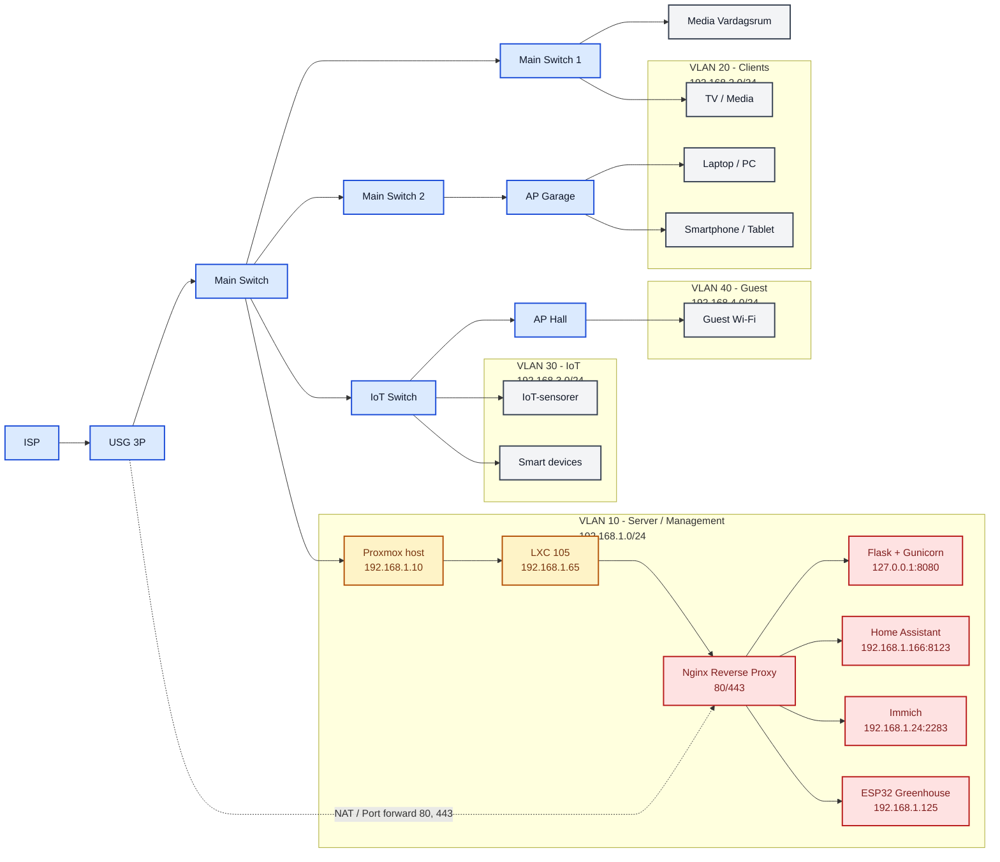

# Topologi mitt natverk

Visuell presentation av nätverkstopologin baserad på den aktuella infrastrukturen, inklusive VLAN, switchar, access points, firewall och IP-segment.

## Exponerade tjänster och domäner

- `rudbergloggar.duckdns.org` -> Nginx i LXC (`192.168.1.65`)
- `rud4berg.duckdns.org` -> vidare till Home Assistant (`192.168.1.166:8123`)
- `rud4bergimmich.duckdns.org` -> vidare till Immich (`192.168.1.24:2283`)

## IP-plan och logiska segment

- VLAN 10 - Server / Management: `192.168.1.0/24`
- VLAN 20 - Clients: `192.168.2.0/24`
- VLAN 30 - IoT / sensorer: `192.168.3.0/24`
- VLAN 40 - Guest: `192.168.4.0/24`

## Trafikflöde

1. Klienten ansluter via Wi‑Fi eller kabel.
2. Trafiken går via access point och switch till USG / firewall.
3. USG tillämpar NAT, VLAN-policy och port forwarding.
4. Extern trafik till port 80/443 dirigeras till Nginx i LXC.
5. Nginx beslutar backend baserat på värdnamn och endpoint.
6. Flask hanterar loggsidor, medan andra tjänster proxas vidare till HA, Immich eller ESP32.

## Notering

Detta diagram är baserat på den visade topologin med central switch, sekundära switchar, AP:er och logiska VLAN-segment för att spegla den faktiska nätverkslayouten i drift.
