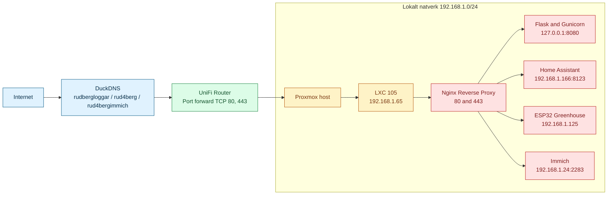

# Topologi mitt natverk

Visuell presentation av natverkstopologin for drift, felsokning och dokumentation.

## Exponerade domaner och mal

- `rudbergloggar.duckdns.org` -> Nginx i LXC (`192.168.1.65`)
- `rud4berg.duckdns.org` -> proxas vidare till Home Assistant (`192.168.1.166:8123`)
- `rud4bergimmich.duckdns.org` -> proxas vidare till Immich (`192.168.1.24:2283`)

## Trafikflode

1. Klient fragar DuckDNS om doman.
2. Trafik gar till publik IP och skickas via UniFi port forwarding till `192.168.1.65`.
3. Nginx valjer backend baserat pa host och path.
4. Flask hanterar loggsidor, medan ovriga requests proxas till respektive LAN-tjanst.
